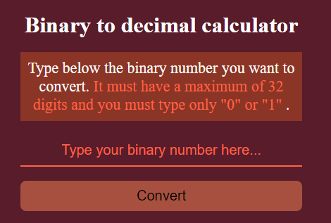

# Binary To Decimal Calculator

## Introduction
This project was inspired on the first idea from the [App-Ideas repository](https://github.com/florinpop17/app-ideas). It calculates a decimal number through a binary number input.

## Features
- [x] One can insert up to 32 digits of binary number
- [x] Notification if anything other than 0 or 1 was inserted
- [x] User views the results in a single output field containing the decimal number equivalent to what was entered

## Use
The user interface can be accessed through the Browser in the `bin2dec.html` file.

## User interface
Accessing the file, you will have the following user interface:
